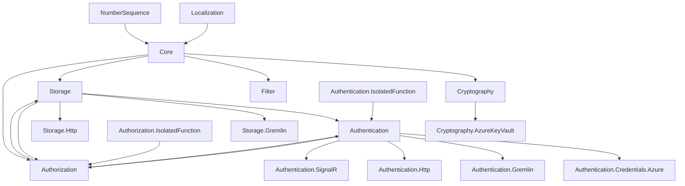

# Sidub Platform Overview

Introducing **Sidub Platform**, a comprehensive collection of software libraries designed to facilitate structured and efficient enterprise .NET development. These libraries define essential concepts and offer reusable functionality to support business and enterprise systems developers. From localization support to core platform concepts and beyond, the Sidub Platform empowers developers to streamline their tasks and accelerate software development.

## Features

### Utility

- **Globalization / Localization:**  
  Provides comprehensive support for globalization and localization throughout the entire platform, ensuring that every layer – from system-level logging and exceptions to user-facing messages – is adaptable to different languages and regions.

- **Service Registry:**  
  Enables the registration and interaction with Sidub service references, providing a unified approach to service discovery and management within your system.

- **Filter / Query Strings:**  
  Offers domain-based filter models that can be parsed into any query language or syntax, enhancing data querying and filtering capabilities.

- **Numbering Sequences:**  
  Supports defining various number sequence types and structures essential for generating sequenced or random unique identifiers used in structured record identification.

### Entity Framework

- **Entity and Entity Relationships:**  
  Facilitates the definition and management of complex data models and their relationships, ensuring data integrity and consistency.

- **Entity (De)serialization:**  
  Allows for the serialization and deserialization of entities into JSON, XML, or any required format, supporting diverse data interchange needs.

- **Entity Partitioning:**  
  Supports programmatic or runtime-based partitioning of entities, optimizing data storage and retrieval.

- **Entity Change Tracking:**  
  Enables tracking of changes to entities, crucial for auditing purposes and enhancing CRUD (Create, Read, Update, Delete) performance.

### Storage / API Layer

- **Entity Persistence:**  
  Facilitates the retrieval and persistence of entities against various data stores, ensuring data durability and availability.

- **APIs Actions and Functions:**  
  Provides tools for calling API actions and functions, allowing seamless integration and interaction with external services.

- **Extensibility:**  
  Supports building custom handlers to communicate with any data source or API, offering data access and integration flexibility.

- **Authentication:**  
  Supports multiple authentication mechanisms for user and service-based identity, including public client flows for user authentication and confidential client flows for service authentication. This ensures secure and efficient authentication processes across various scenarios within the platform.

### Storage / API Extensions

- **Gremlin Storage Extension:**  
  Enables connectivity with Gremlin-based graph databases, facilitating complex data relationships and queries.

- **HTTP Storage Extension:**  
  Enables integration with HTTP-based storage services and APIs, including OData, Azure Table, Blob, and Queue Storage, as well as any HTTP-based API service. This extension provides connectors and handlers for seamless data management across these services, leveraging the platform's built-in authentication.

### Security & Cryptography

- **Encryption / Decryption:**  
  Supports encrypting and decrypting data and entities for secure information handling.

- **Signing / Verification:**  
  Enables signing and verification of data and entities to ensure integrity and authenticity.

- **Extensibility:**  
  Supports integration with local cryptographic hardware, Azure Key Vault, or custom handlers to connect with your chosen vault or cryptographic service.

## Libraries

The following libraries compose the Sidub Platform. Packages are distributed on NuGet.org, and source code is available on GitHub.com for open-source licensed projects. Licensing terms are available in each library’s public repository or project page.

| Library | Description | License Dependencies |
| --- | --- | --- |
| **Localization** | Provides localization support to allow adaptation of software for various languages and cultures. | MIT, DotNet Library License |
| **Filter** | Provides ability to define filters/queries which may be parsed to various query languages. | MIT, DotNet Library License |
| **Core** | Defines core platform concepts (entities, relationships, etc.) and provides a variety of functionality for interacting with core concepts. | Sidub Platform, Metalama License, MIT, DotNet Library License |
| **NumberSequence** | Provides concepts to allow the definition of identifiers using various number sequence concepts. Allows developers to generate and maintain structured identifiers to apply against records easily. | Sidub Platform, MIT, DotNet Library License |
| **Cryptography.AzureKeyVault** | Provides cryptographic functionality to allow developers to encrypt/decrypt, sign/verify data, and perform other cryptographic functions against data and entities. | Sidub Platform, MIT, DotNet Library License |
| **Authentication.Credentials.Azure** | Provides authentication concepts and abstractions used to perform authentication throughout the platform; enables authentication against data sources and services. | Sidub Platform, MIT, DotNet Library License |
| **Authentication.Gremlin** | Provides specific authentication implementations against various connection or service types. | Sidub Platform, MIT, DotNet Library License, Apache 2.0 |

> **Note:** License dependencies are not cumulative; see package dependencies.

## Release State Terms and Information

| Library | License | Release | Library Type |
| --- | --- | --- | --- |
| **Localization** | AGPLv3 / proprietary | Public | Functional |
| **Filter** | AGPLv3 / proprietary | Public | Functional |
| **Core** | AGPLv3 / proprietary | Public | Functional |
| **NumberSequence** | AGPLv3 / proprietary | Public | Functional |
| **Cryptography** | Private | Functional | Complete; pending public release |
| **Cryptography.AzureKeyVault** | Private | Supporting | Complete; pending public release |
| **Authentication** | Private | Functional | Complete; pending public release |
| **Authentication.Credentials.Azure** | Private | Supporting | Complete; pending public release |
| **Authentication.Gremlin** | Private | Supporting | Complete; pending public release |
| **Authentication.Http** | Private | Supporting | Complete; pending public release |
| **Authentication.IsolatedFunction** | Private | Functional | Complete; pending public release |
| **Authentication.SignalR** | Private | Supporting | Complete; pending public release |
| **Authorization** | Private | Functional | Future release (in progress) |
| **Authorization.IsolatedFunction** | Private | Functional | Complete; pending public release |
| **Storage** | AGPLv3 / proprietary | Private | Functional | Complete; pending public release |
| **Storage.Gremlin** | AGPLv3 / proprietary | Private | Supporting | Complete; pending public release |
| **Storage.Http** | AGPLv3 / proprietary | Private | Supporting | Complete; pending public release |
| **Storage.MySql** | AGPLv3 / proprietary | Private | Supporting | Future release (license conflict) |

## Dependencies

Certain libraries within the platform have interdependencies; a chart has been included within the appendix which exhibits these dependencies.

## Appendix

### License Dependency References

- **MIT**  
  [https://licenses.nuget.org/MIT](https://licenses.nuget.org/MIT)

- **DotNet Library License**  
  [https://dotnet.microsoft.com/en-us/dotnet_library_license.htm](https://dotnet.microsoft.com/en-us/dotnet_library_license.htm)

- **Metalama License**  
  [https://www.nuget.org/packages/Metalama.Framework/2024.0.11/license](https://www.nuget.org/packages/Metalama.Framework/2024.0.11/license)

- **Apache 2.0**  
  [https://licenses.nuget.org/Apache-2.0](https://licenses.nuget.org/Apache-2.0)

### Platform Interdependencies

